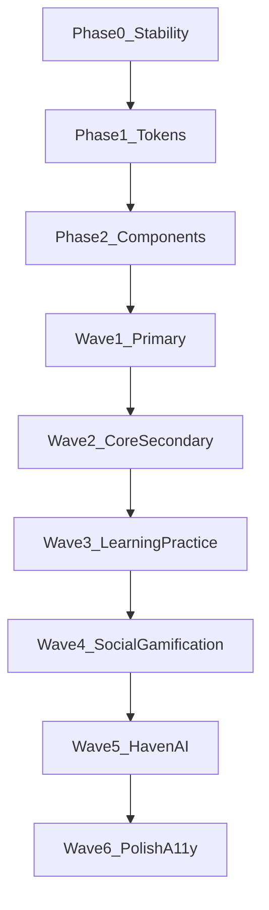

# Kairos Full-App Redesign Plan

> Decisions locked: redesign **all** screens (including secondary/gamification/Haven); **honor** [DESIGN.md](../../DESIGN.md) and [PRODUCT.md](../../PRODUCT.md) as the visual and product brief. Current UI is anti-reference, not material to polish.

**Goal:** Make every Compose surface match the restrained mineral-editorial system already written in DESIGN.md, kill Prody-era visual debt, and stop instant-launch crashes so redesign can be verified on device.

**Stack:** Kotlin, Jetpack Compose Material3, Hilt, Room/SQLCipher, Navigation Compose.

**Skills applied (guidance):** impeccable (redesign replaces look, preserves product truth), design-taste-frontend (anti-slop / redesign-audit), ui-ux-pro-max + mobile-android-design (Compose/M3). Paperclip `design-guide` is installed for craft discipline only — its dense dark control-plane defaults do **not** override Kairos DESIGN.md.

---

## Critical condition (audit verdict)

Kairos has a strong brief and a thin `Focused*` veneer. The rest of the tree is still Prody: dual token systems, gamified component libs, emoji icons, Buddha residue, card farms, hardcoded colors, and ~56 screens that do not share one visual language.

| Claim (DESIGN/PRODUCT) | Reality |
|---|---|
| Editorial + restrained mineral indigo | Partial on Focused*; false elsewhere |
| Glass only on floating chrome | Glass/glow libraries still used as decoration |
| Lora for reflective text | `FontFamily.Serif` alias; no bundled Lora |
| No all-caps headings | `WORD` / `THOUGHT` / `VOCABULARY` / `KAIROS LABS` |
| Quiet progress, not casino | Streak fire, XP, rarity, missions emoji, MagicalEffects |
| No mystical AI voice | Buddha toggles, “contemplating” animation, Haven mystical framing |
| Lists/sections not card grids | Digest/Home/DeepDive/Learning/Challenges are card farms |

**Worst offenders:** `HomeScreen`, `MagicalEffects` / `PremiumEffects` / `GamificationComponents`, `MissionsScreen`, `SocialComponents`, `WeeklyDigestScreen`, `ChallengesScreen`, `SettingsScreen` hardcodes, `Color.kt` gamification block, `Tokens.kt` (parallel scale).

**Least unfinished:** `FocusedTodayScreen`, Focused Learn/Reflect/Library, `components/kairos/*`.

---

## Phase 0 — Launch stability (blocker before redesign)

App reportedly opens then instantly closes. Repo docs do not confirm a device crash; code has clear startup death paths.

### Likely causes (ranked)

1. **Eager Hilt inject in Application** — `GamificationService` + `WitnessModeManager` force EncryptedSharedPreferences + Room/SQLCipher during `super.onCreate()` ([KairosApplication.kt](../../app/src/main/java/com/kairos/app/KairosApplication.kt)).
2. **SQLCipher `loadLibs()`** during first DB provide ([DatabaseFactory.kt](../../app/src/main/java/com/kairos/app/data/local/database/DatabaseFactory.kt)).
3. **Passphrase wipe after destructive migration** — `onDestructiveMigration` calls `clearDatabaseEncryption()` ([DatabaseLifecycleCallback.kt](../../app/src/main/java/com/kairos/app/data/local/database/DatabaseLifecycleCallback.kt) L62–70), bricking the next cold start.
4. **Firebase Auth hard-fail** when `MainActivity` injects `AuthRepository`.
5. Duplicate `mobilesdk_app_id` for release/debug in `google-services.json` (suspect, not proven).

### Phase 0 tasks

1. Capture logcat on a real install (`AndroidRuntime`, `KairosApplication`, `StorageModule`, `KairosDatabase`, CrashHandler / CrashActivity).
2. Stop injecting DB/prefs-heavy services as Application fields; schedule after first frame or via WorkManager.
3. Harden EncryptedSharedPreferences recovery: never throw on startup; if prefs wipe, delete the encrypted DB file too.
4. Remove `clearDatabaseEncryption()` from `onDestructiveMigration`.
5. Soft-fail Firebase Auth so local-first entry works without Firebase.
6. Verify cold start on emulator + one physical device before any visual PR merges.

**Exit criteria:** App stays open on cold start after clear data and after an upgrade path; CrashActivity is not the first thing users see.

---

## Design system law (non-negotiable)

Single source of visual truth: **DESIGN.md + `KairosDesign` tokens**.

| Allowed | Banned |
|---|---|
| `KairosSpacing` / `KairosRadius` / glass CompositionLocals | Parallel `Tokens.kt` spacing with different values |
| Mineral indigo / clay / verdigris / warm neutrals from theme | Raw `Color(0x…)` in screens; purple premium; rarity rainbow as chrome |
| Glass on nav + compact floating controls only | Glass/blur/glow on reading content |
| Native sans UI + real Lora (bundled) for quotes/journal | System-serif alias pretending to be Lora; Poppins branding leftovers |
| Sentence case labels | ALL CAPS eyebrows (`WORD`, `VOCABULARY`, …) |
| Material/Kairos vector icons | Emoji-as-icon (`🎉`, `🔥`, reaction rows) |
| Motion ≤320ms; reduced-motion respected | MagicalEffects ambient loops; 800–1200ms “dramatic” |
| Quiet progress evidence | Casino streak/XP/rarity chrome language |
| PRODUCT voice: clear, warm, observant | Buddha / journey / unlock / magic copy |

**Dials (taste-skill, adapted for product UI):** Variance 4 · Motion 3 · Density 4 — editorial calm, not Awwwards or dashboard density.

---

## Phase 1 — One token system

Consolidate so every later screen rewrite cannot “accidentally” use Prody scales.

### Tasks

1. Expand [KairosDesign.kt](../../app/src/main/java/com/kairos/app/ui/theme/KairosDesign.kt) into the only spacing/radius/elevation/glass API.
2. Slim [Color.kt](../../app/src/main/java/com/kairos/app/ui/theme/Color.kt): keep semantic brand + light/dark schemes; move or delete streak/rarity/premium/purple/gradient kitchen sink from chrome usage.
3. Rewrite [Type.kt](../../app/src/main/java/com/kairos/app/ui/theme/Type.kt): Material3 type scale + reflective Lora styles only; drop gamification display catalog.
4. Bundle real Lora under `res/font/` (DESIGN claims it; Type currently aliases Serif).
5. Collapse [Shape.kt](../../app/src/main/java/com/kairos/app/ui/theme/Shape.kt) to core radii matching `KairosRadius` (control 16–20, reading 28, nav capsule).
6. Deprecate then delete usages of [Tokens.kt](../../app/src/main/java/com/kairos/app/ui/theme/Tokens.kt); remove file when references are zero.
7. Cap nav transition at ≤320ms in [KairosNavigation.kt](../../app/src/main/java/com/kairos/app/ui/navigation/KairosNavigation.kt).
8. Provide theme only through `KairosTheme` / CompositionLocals — no screen-local palettes except temporary Haven soft accents mapped into extended theme.

**Exit criteria:** Grep shows zero `KairosTokens.Spacing`, zero screen-level `Color(0x` outside theme, Lora loads from resources.

---

## Phase 2 — Component purge and rebuild

Replace effect libraries with a small Kairos primitive set.

### Delete or gut (anti-reference)

- `MagicalEffects.kt`, `PremiumEffects.kt`, `VoidEffect.kt`, `EnhancedAnimations.kt` (decorative ambient)
- Casino-forward chrome in `GamificationComponents.kt`, `BoostingSystem.kt`, `RankComponents.kt`, `SoulLayerComponents.kt` — restyle to quiet evidence or remove from primary paths
- Emoji icon patterns in missions/social/locker/digest

### Keep / harden under `components/kairos/`

- `KairosSurface` (matte reading + glass chrome variants)
- `KairosHeader`, `KairosMark`, `KairosNavigation`
- Buttons, chips, empty states, loading skeletons, list rows, section headers
- Progress: thin evidence line / count — not fire streaks as hero chrome

### New shared patterns every screen must use

1. **PageShell** — insets, max measure, background
2. **SectionHeader** — title + one supporting line, sentence case
3. **ReadingSurface** — 28dp matte panel for word/quote/journal body
4. **ListRow** — primary secondary actions without nested cards
5. **QuietProgress** — retention/streak as secondary metadata
6. **EmptyState** — teaches next action (PRODUCT)

---

## Phase 3 — Screen redesign waves (all surfaces)

Every screen stays in the product; every screen is restyled to DESIGN.md. Order is risk/visibility, not deletion.

### Wave 1 — Primary IA (ship-blocker for taste)

| Screen | Path | Work |
|---|---|---|
| Today | `FocusedTodayScreen` | Remove ALL CAPS; real Lora on thought; tighten panels to tokens; kill “Growth Seeker” residue |
| Learn | `FocusedLearnScreen` | Tokenize padding; matte overview; list not glass card |
| Reflect | `FocusedReflectScreen` | Custom field chrome; reading measure |
| Library | `FocusedLibraryScreen` | Segmented catalog polish; consistent rows |
| Scaffold | `MainActivity` + `KairosNavigation` | Glass only on nav; inset discipline |

### Wave 2 — Entry + identity

Onboarding, Auth, Profile, Edit Profile, Settings, Banner/Achievements collections, Search.

Focus: kill `Color(0x` in Settings (~38), Buddha-labeled toggles → PRODUCT voice (“guidance tone”), sentence-case “Kairos Labs” if kept.

### Wave 3 — Learning / practice / content

Vocabulary detail, flashcards, wisdom, quotes, idioms, learning paths, deep dive, letter, microjournal, journal history/create, future message, weekly digest, ritual, meditation, wrapped.

Focus: card farms → sections/lists; Digest share copy without emoji seeds; Deep Dive / Learning home lose nested card grids.

### Wave 4 — Social / gamification (restyle, do not delete)

Missions, Challenges, Collaborative, Social, Locker, Stats, HomeScreen (legacy dashboard if still reachable), streak/leaderboard components.

Focus: progress as quiet evidence; replace emoji trophies with icons; no fire/inferno chrome; keep mechanics, change costume.

### Wave 5 — Haven / AI

Haven home/chat/exercise, writing companion, AI onboarding components.

Focus: infrastructure not personality; no purple AI gradient; no Buddha contemplating; calm support surfaces using mineral system + restrained Haven accent via extended theme only.

### Wave 6 — Cross-cutting polish

- Accessibility: 48dp targets, AA contrast, semantics, large-font reflow
- Dark/light parity on every wave screen
- Reduced-motion: no spatial loops
- Screenshot / Compose preview baselines for primary + one secondary per package
- Copy audit: strip journey/magic/Buddha/unlock language app-wide

**Per-screen checklist (mandatory before marking done)**

- [ ] Uses only KairosDesign / theme colors
- [ ] No emoji icons
- [ ] No ALL CAPS labels
- [ ] Glass only if floating chrome
- [ ] One primary action obvious
- [ ] Empty/error/loading states present
- [ ] Light + dark checked
- [ ] Reduced-motion checked

---

## Phase 4 — Verification

1. Cold-start + navigation smoke on emulator/device (Phase 0 still green).
2. Visual pass: four tabs + Profile/Settings + Haven + Missions (representative secondary).
3. Static: no `Color(0x` outside theme; no `KairosTokens`; no Magical/Premium effect imports.
4. `bash ./scripts/verify_kairos.sh` + CI Gradle.
5. Optional: Paparazzi/screenshot tests for Focused* + Onboarding.

---

## Execution order (recommended PR slices)

| PR | Scope |
|---|---|
| 0 | Launch crash hardening |
| 1 | Token consolidation + Lora + Type/Shape slim |
| 2 | Kairos primitives + delete Magical/Premium effect usage |
| 3 | Wave 1 primary screens |
| 4 | Wave 2 entry/identity |
| 5 | Wave 3 content/practice |
| 6 | Wave 4 social/gamification restyle |
| 7 | Wave 5 Haven/AI restyle |
| 8 | Wave 6 a11y + copy + verification |

Do not start Wave N+1 until Wave N passes the per-screen checklist on device.

---

## Explicit non-goals

- Rewriting PRODUCT.md or DESIGN.md visual direction (honored as-is).
- Deleting secondary features from the nav graph (user chose redesign-all).
- Adopting Paperclip’s dense dark control-plane aesthetic.
- Adding new features during redesign.

---

## Success definition

A user can open Kairos cold, stay in the app, and move through Today → Learn → Reflect → Library → Profile → Haven → Missions without leaving the mineral-editorial world. Secondary features keep their jobs but look like the same product — not a Prody theme park bolted under glass nav.
